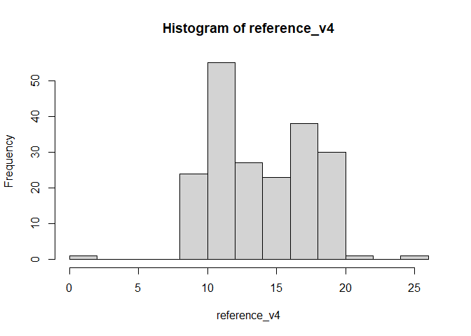
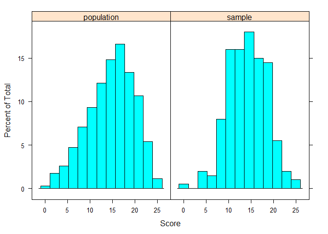
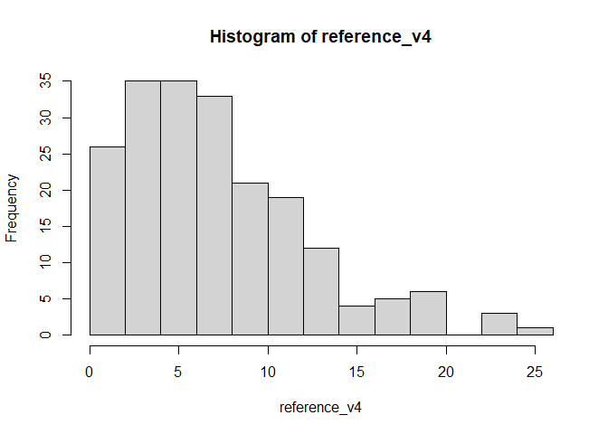
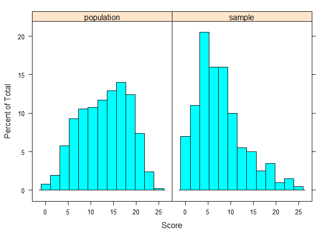
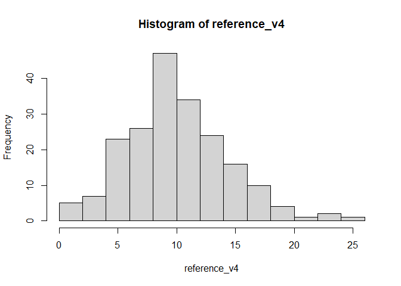
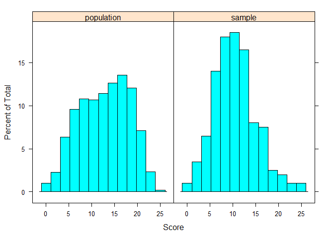

<!-- README.md is generated from README.Rmd. Please edit that file -->

# drawsample

<!-- badges: start -->

<!-- badges: end -->

The goal of drawsample is to …

## Installation

You can install the released version of drawsample from
[CRAN](https://CRAN.R-project.org) with:

``` r
install.packages("drawsample")
```

And the development version from [GitHub](https://github.com/) with:

``` r
# install.packages("devtools")
devtools::install_github("atalay-k/drawsample",dependencies = TRUE,upgrade = "never")
```

## Example

Same basic examples for the usage:

``` r
library(drawsample)
## basic example code
# Draw a sample based on Score_1(from negatively skewed to normal)
 draw_sample(dist=example_data[,c(1,2)],n=200,skew = 0,kurts = 0,
 output_name = c("sample", "1"))
```



    #> $desc
    #>               n  mean   sd min max  skew kurtosis
    #> population 5000 14.61 4.90   0  25 -0.40    -0.35
    #> reference   200 13.61 4.04   0  25 -0.04    -0.04
    #> sample      200 14.12 4.08   0  25 -0.12     0.05
    #> 
    #> $sample
    #> # A tibble: 200 x 2
    #>       id     x
    #>    <dbl> <dbl>
    #>  1  2538     0
    #>  2  4739     4
    #>  3  3851     5
    #>  4  2397     5
    #>  5  3750     5
    #>  6  4039     7
    #>  7  1730     8
    #>  8  1812     8
    #>  9   651     7
    #> 10  2551     8
    #> # ... with 190 more rows
    #> 
    #> $graph



``` r
# Draw a sample based on Score_2 (from negatively skewed to positively skewed)
 draw_sample(dist=example_data[,c(1,3)],n=200,skew = 1,kurts = 1,
 output_name = c("sample", "2"))
```



    #> $desc
    #>               n  mean   sd min max  skew kurtosis
    #> population 5000 12.78 5.22   0  25 -0.17    -0.88
    #> reference   200  7.21 5.11   0  25  1.04     0.98
    #> sample      200  7.76 5.08   0  25  0.99     0.76
    #> 
    #> $sample
    #> # A tibble: 200 x 2
    #>       id     x
    #>    <dbl> <dbl>
    #>  1  3072     1
    #>  2  4912     1
    #>  3  1483     1
    #>  4  1856     1
    #>  5   948     1
    #>  6  3007     1
    #>  7  3268     2
    #>  8     7     2
    #>  9   478     2
    #> 10  2855     2
    #> # ... with 190 more rows
    #> 
    #> $graph



``` r
# Draw a sample based on Score_2 (from negatively skewed to positively skewed with replacement)
 draw_sample(dist=example_data[,c(1,3)],n=200,skew = 0.5,kurts = 0.4,
 replacement=TRUE,output_name = c("sample", "3"))
```



    #> $desc
    #>               n  mean   sd min max  skew kurtosis
    #> population 5000 12.78 5.22   0  25 -0.17    -0.88
    #> reference   200 10.04 4.38   0  25  0.48     0.44
    #> sample      200 10.55 4.41   0  25  0.47     0.45
    #> 
    #> $sample
    #> # A tibble: 200 x 2
    #>       id     x
    #>    <dbl> <dbl>
    #>  1  1728     2
    #>  2  2538     0
    #>  3  4509     2
    #>  4  3896     1
    #>  5  2855     2
    #>  6  4372     4
    #>  7  4870     3
    #>  8  4895     4
    #>  9   456     3
    #> 10  4404     3
    #> # ... with 190 more rows
    #> 
    #> $graph


