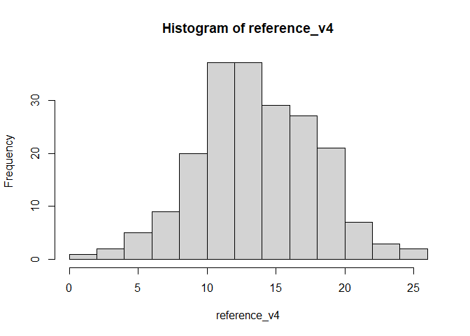

<!-- README.md is generated from README.Rmd. Please edit that file -->

# drawsample

<!-- badges: start -->
<!-- badges: end -->

The goal of drawsample is to take sample/s data/s with desired
properties.

## Installation

You can install the development version of drawsample from
[GitHub](https://github.com/) with:

``` r
# install.packages("devtools")
devtools::install_github("atalay-k/drawsample")
```

## Example

This is a basic example which shows you how to solve a common problem:

``` r
library(drawsample)
data(example_data)
# First 6 rows of the example_data
head(example_data)
#> # A tibble: 6 × 3
#>      ID Score_1 Score_2
#>   <dbl>   <dbl>   <dbl>
#> 1     1      16      18
#> 2     2      23      24
#> 3     3      13      11
#> 4     4      14       8
#> 5     5      20      17
#> 6     6      20      17
# Draw a sample based on Score_1(from negatively skewed to normal)
output1 <- draw_sample(dist=example_data[,c(1,2)],n=200,skew = 0,kurts = 0,
save.output=FALSE) 
```


